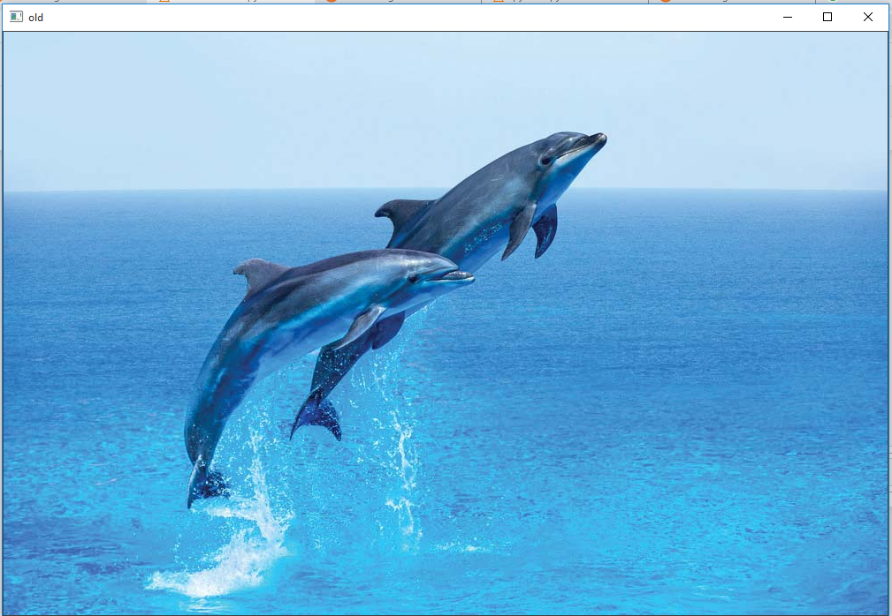

# Digital-Image-Processing-Lab
**1. Develop a program to display grayscale image using read and write operation.**
```python
import cv2
import numpy as np

image = cv2.imread('flower.jpg')
image = cv2.resize(image, (0, 0), None, 1, 1)

grey = cv2.cvtColor(image, cv2.COLOR_RGB2GRAY)
grey_3_channel = cv2.cvtColor(grey, cv2.COLOR_GRAY2BGR)

numpy_horizontal = np.hstack((image, grey_3_channel))
numpy_horizontal_concat = np.concatenate((image, grey_3_channel), axis=1)

cv2.imshow('FLOWER', numpy_horizontal_concat)
cv2.waitKey()
```
***output:***


---
**2.Develop a program to perform linear transformations on an image: Scaling and Rotation**
```python

#scaling
import cv2
import numpy as np
FILE_NAME = 'flower.jpg'
try: 
    img = cv2.imread(FILE_NAME) 
    (height, width) = img.shape[:2] 
    res = cv2.resize(img, (int(width / 2), int(height / 2)), interpolation = cv2.INTER_CUBIC) 
    cv2.imwrite('result.jpg', res) 
    cv2.imshow('image',img)
    cv2.imshow('result',res)
    cv2.waitKey(0)
except IOError: 
    print ('Error while reading files !!!')
    cv2.waitKey(0)
    cv2.destroyAllWindows(0)
```
***output:***


---
```python
#rotation
import cv2 
import numpy as np 

FILE_NAME = 'flower.jpg'
img = cv2.imread(FILE_NAME) 
(rows, cols) = img.shape[:2] 
M = cv2.getRotationMatrix2D((cols / 2, rows / 2), 45, 1) 
res = cv2.warpAffine(img, M, (cols, rows)) 
cv2.imshow('result.jpg', res) 
cv2.waitKey(0)
```
***output:***


---
**3. Develop a program to find the sum and mean of a set of images. 
     Create ‘n’ number of images and read them from the directory and perform the operations.**

```python

#sum & Mean
import os
path=r'E:\image'
imgs=[]
files=os.listdir(path) #List
for file in files:
    fpath=path+'\\'+file
    imgs.append(cv2.imread(fpath))
    
for i,im in enumerate(imgs):
    cv2.imshow(files[i],imgs[i])    
    cv2.imshow('Mean of '+files[i],len(im)/im)
print('sum of imgs(Total no) = ',i+1)    
cv2.waitKey(0)
cv2.destroyAllWindows()

```
```
sum of imgs(Total no) =  4
```
***output:***


---
**4. Develop a program to convert the color image to gray scale and binary image**
```python
#gray image
import cv2
img = cv2.imread("img2.jpg")
gray=cv2.cvtColor(img,cv2.COLOR_BGR2GRAY)
cv2.imshow("gray",gray)
cv2.waitKey(0)
cv2.destroyAllWindows()
ret, bw_img = cv2.threshold(img,127,255,cv2.THRESH_BINARY)
cv2.imshow("Binary Image",bw_img)
cv2.waitKey(0)
cv2.destroyAllWindows()
```
***output:***


---

**5.	Develop a program to convert the given color image to different color spaces.**
```python
import cv2
img = cv2.imread("img4.jpg")
gray=cv2.cvtColor(img,cv2.COLOR_BGR2GRAY)
hsv=cv2.cvtColor(img,cv2.COLOR_BGR2HSV)
lab=cv2.cvtColor(img,cv2.COLOR_BGR2LAB)
hls=cv2.cvtColor(img,cv2.COLOR_BGR2HLS)
yuv=cv2.cvtColor(img,cv2.COLOR_BGR2YUV)

cv2.imshow("GRAY",gray)
cv2.waitKey(0)

cv2.imshow("HSV",hsv)
cv2.waitKey(0)

cv2.imshow("LAB",lab)
cv2.waitKey(0)

cv2.imshow("HLS",hls)
cv2.waitKey(0)

cv2.imshow("YUV",yuv)
cv2.waitKey(0)
cv2.destroyAllWindows()
ret, bw_img = cv2.threshold(img,127,255,cv2.THRESH_BINARY)
cv2.destroyAllWindows()


```
***output:***



---

**6.	Develop a program to create an image from 2D array (generate an array of random size).**
```python
import cv2
import numpy as np
#Random 2D Array
array_img=np.random.randint(255,size=(300,500),dtype=np.uint8)
cv2.imshow('arrayimage',array_img)
cv2.waitKey(0)
cv2.destroyAllWindows()

```
***output:***

