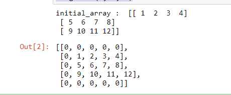

# Digital-Image-Processing-Lab


**1. Develop a program to display grayscale image using read and write operation.**
**description:**

**Binary images:** are images whose pixels have only two possible intensity values. ... Binary images are often produced by thresholding a grayscale or color image, in order to separate an object in the image from the background. The color of the object (usually white) is referred to as the foreground color.

**grayscale image:** A grayscale (or graylevel) image is simply one in which the only colors are shades of gray. ... Often, the grayscale intensity is stored as an 8-bit integer giving 256 possible different shades of gray from black to white.

**#** to read an image we use the function cv2.imread().
**#** to save a image we use cv2.imwrite().
**#** to destory all the windows().

```python
import cv2
import numpy as np

image = cv2.imread('flower.jpg')
image = cv2.resize(image, (0, 0), None, 1, 1)

grey = cv2.cvtColor(image, cv2.COLOR_RGB2GRAY)
grey_3_channel = cv2.cvtColor(grey, cv2.COLOR_GRAY2BGR)

numpy_horizontal = np.hstack((image, grey_3_channel))
numpy_horizontal_concat = np.concatenate((image, grey_3_channel), axis=1)

cv2.imshow('FLOWER', numpy_horizontal_concat)
cv2.waitKey()
```
***output:***


---
**2.Develop a program to perform linear transformations on an image: Scaling and Rotation**

**description:** Scaling is the procedure of measuring and assigning the objects to the numbers according to the specified rules. In other words, the process of locating the measured objects on the continuum, a continuous sequence of numbers to which the objects are assigned is called as scaling.
**#** cv2.resize() is uesd to resizes the given iamges.
```python

#scaling
import cv2
import numpy as np
FILE_NAME = 'flower.jpg'
try: 
    img = cv2.imread(FILE_NAME) 
    (height, width) = img.shape[:2] 
    res = cv2.resize(img, (int(width / 2), int(height / 2)), interpolation = cv2.INTER_CUBIC) 
    cv2.imwrite('result.jpg', res) 
    cv2.imshow('image',img)
    cv2.imshow('result',res)
    cv2.waitKey(0)
except IOError: 
    print ('Error while reading files !!!')
    cv2.waitKey(0)
    cv2.destroyAllWindows(0)
```
***output:***


---
```python
#rotation
import cv2 
import numpy as np 

FILE_NAME = 'flower.jpg'
img = cv2.imread(FILE_NAME) 
(rows, cols) = img.shape[:2] 
M = cv2.getRotationMatrix2D((cols / 2, rows / 2), 45, 1) 
res = cv2.warpAffine(img, M, (cols, rows)) 
cv2.imshow('result.jpg', res) 
cv2.waitKey(0)
```
***output:***


---
**3. Develop a program to find the sum and mean of a set of images. 
     Create ‘n’ number of images and read them from the directory and perform the operations.**
     
**description:**
   img.append is uesd to append all the images together
   Adding Images To add two images or add a constant value to an image. • [imadd] function adds the value of each pixel in one of the input images with the corresponding pixel in the other input image and returns the sum in the corresponding pixel of the output image.

```python

#sum & Mean
import os
path=r'E:\image'
imgs=[]
files=os.listdir(path) #List
for file in files:
    fpath=path+'\\'+file
    imgs.append(cv2.imread(fpath))
    
for i,im in enumerate(imgs):
    cv2.imshow(files[i],imgs[i])    
    cv2.imshow('Mean of '+files[i],len(im)/im)
print('sum of imgs(Total no) = ',i+1)    
cv2.waitKey(0)
cv2.destroyAllWindows()

```
```
sum of imgs(Total no) =  4
```
***output:***


---
**4. Develop a program to convert the color image to gray scale and binary image**

**description:**

**Binary images:** are images whose pixels have only two possible intensity values. ... Binary images are often produced by thresholding a grayscale or color image, in order to separate an object in the image from the background. The color of the object (usually white) is referred to as the foreground color.

**grayscale image:** A grayscale (or graylevel) image is simply one in which the only colors are shades of gray. ... Often, the grayscale intensity is stored as an 8-bit integer giving 256 possible different shades of gray from black to white.

**threshold:** Thresholding produces a binary image, where all pixels with intensities above (or below) a threshold value are turned on, while all other pixels are turned off.

```python
#gray image
import cv2
img = cv2.imread("img2.jpg")
gray=cv2.cvtColor(img,cv2.COLOR_BGR2GRAY)
cv2.imshow("gray",gray)
cv2.waitKey(0)
cv2.destroyAllWindows()
ret, bw_img = cv2.threshold(img,127,255,cv2.THRESH_BINARY)
cv2.imshow("Binary Image",bw_img)
cv2.waitKey(0)
cv2.destroyAllWindows()
```
***output:***


---

**5.Develop a program to convert the given color image to different color spaces.**

**description:**
A color space is a specific organization of colors. ... Adding a specific mapping function between a color model and a reference color space establishes within the reference color space a definite "footprint", known as a gamut , and for a given color model this defines a color space.
**#** COLOR_BGR2RGB is used to convert bgr image to RGB image
**#** COLOR_BGR2HSV is used to convert BGR image to HSV image
**#** COLOR_BGR2YCrCb is uesd to convert BGR image to YCrCb image

```python
import cv2
img = cv2.imread("img4.jpg")
gray=cv2.cvtColor(img,cv2.COLOR_BGR2GRAY)
hsv=cv2.cvtColor(img,cv2.COLOR_BGR2HSV)
lab=cv2.cvtColor(img,cv2.COLOR_BGR2LAB)
hls=cv2.cvtColor(img,cv2.COLOR_BGR2HLS)
yuv=cv2.cvtColor(img,cv2.COLOR_BGR2YUV)

cv2.imshow("GRAY",gray)
cv2.waitKey(0)

cv2.imshow("HSV",hsv)
cv2.waitKey(0)

cv2.imshow("LAB",lab)
cv2.waitKey(0)

cv2.imshow("HLS",hls)
cv2.waitKey(0)

cv2.imshow("YUV",yuv)
cv2.waitKey(0)
cv2.destroyAllWindows()
ret, bw_img = cv2.threshold(img,127,255,cv2.THRESH_BINARY)
cv2.destroyAllWindows()


```
***output:***


---

**6.	Develop a program to create an image from 2D array (generate an array of random size).**

**description:**
An image is an array, or a matrix, of square pixels (picture elements) arranged in columns and rows.
An image — an array or a matrix of pixels arranged in columns and rows. In a (8-bit) greyscale image each picture element has an assigned intensity that ranges from 0 to 255.
A 2D array has a type such as int[][] or String[][], with two pairs of square brackets. ... The elements of a 2D array are arranged in rows and columns, and the new operator for 2D arrays specifies both the number of rows and the number of columns.
**PIL:** Python Imaging Library (abbreviated as PIL) (in newer versions known as Pillow) is a free and open-source additional library for the Python programming language that adds support for opening, manipulating, and saving many different image file formats. It is available for Windows, Mac OS X and Linux.
```python
import cv2
import numpy as np
#Random 2D Array
array_img=np.random.randint(255,size=(300,500),dtype=np.uint8)
cv2.imshow('arrayimage',array_img)
cv2.waitKey(0)
cv2.destroyAllWindows()

```
***output:***

---
**program7:Find the sum of the neighborhood values of the matrix.**
```python
import numpy as np

M = [[1, 2, 3],
    [4, 5, 6],
    [7, 8, 9]] 

M = np.asarray(M)
N = np.zeros(M.shape)

def sumNeighbors(M,x,y):
    l = []
    for i in range(max(0,x-1),x+2): 
        for j in range(max(0,y-1),y+2):
            try:
                t = M[i][j]
                l.append(t)
            except IndexError: 
                pass
    return sum(l)-M[x][y] 

for i in range(M.shape[0]):
    for j in range(M.shape[1]):
        N[i][j] = sumNeighbors(M, i, j)

print ("Original matrix:\n", M)
print ("Summed neighbors matrix:\n", N)

```
***output:***

---
***8. Find the neighborhood values of the matrix.***

```python
import numpy as np
ini_array = np.array([[1, 2,3, 4], [5,6, 7, 8], [9, 10, 11,12]])
print("initial_array : ", str(ini_array));
def neighbors(radius, rowNumber, columnNumber):
    return[[ini_array[i][j]if i >= 0 and i < len(ini_array) and j >= 0 and j < len(ini_array[0]) else 0
            for j in range(columnNumber-1-radius, columnNumber+radius)]
           for i in range(rowNumber-1-radius, rowNumber+radius)]
neighbors(2, 2, 2)

```
***OUTPUT***


---

***9. operator overloading***
```c++

#include <iostream.h>
using namespace std; 
class matrix 
{ 
int r1, c1, i, j, a1;
int a[10][10];
public:int get()
{ cout << "Enter the row and column size for the matrix\n";
cin >> r1;
cin >> c1; 
cout << "Enter the elements of the matrix\n"; 
for (i = 0; i < r1; i++) 
{
for (j = 0; j < c1; j++)
{ 
cin>>a[i][j];

} 
}

};
void operator+(matrix a1)
{
int c[i][j];

for (i = 0; i < r1; i++)
{
for (j = 0; j < c1; j++)
{ 
c[i][j] = a[i][j] + a1.a[i][j];
}

} 
cout<<"addition is\n"; 
for(i=0;i<r1;i++)
{
cout<<" "; 
for (j = 0; j < c1; j++)
{ 
cout<<c[i][j]<<"\t"; 
} 
cout<<"\n"; 
}

};

void operator-(matrix a2)
{ 
int c[i][j];

for (i = 0; i < r1; i++) 
{ 
for (j = 0; j < c1; j++) 
{ 
c[i][j] = a[i][j] - a2.a[i][j];
}

} 
cout<<"subtraction is\n";
for(i=0;i<r1;i++) 
{
cout<<" "; 
for (j = 0; j < c1; j++) 
{
cout<<c[i][j]<<"\t";
} 
cout<<"\n"; 
}
}
;
void operator*(matrix a3) 
{
int c[i][j];

for (i = 0; i < r1; i++)
{
for (j = 0; j < c1; j++)
{ 
c[i][j] =0;
for (int k = 0; k < r1; k++)
{
c[i][j] += a[i][k] * (a3.a[k][j]);
}
}
}
cout << "multiplication is\n";
for (i = 0; i < r1; i++) 
{ 
cout << " ";
for (j = 0; j < c1; j++) 
{
cout << c[i][j] << "\t"; 
} 
cout << "\n"; 
}
};

};

int main()
{
matrix p,q; 
p.get(); 
q.get();
p + q;
p - q; 
p * q;
return 0; 
}

```
***OUTPUT***

Enter the row and column size for the matrix 2 2

Enter the elements of the matrix 6 7 8 9

Enter the row and column size for the matrix 2 2

Enter the elements of the matrix 1 2 3 4

addition is 7 9 11 13

subtraction is 5 5 5 5

multiplication is 27 40 35 52

---
